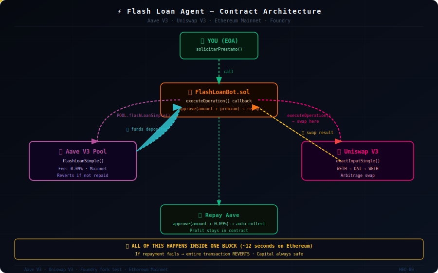

<div align="center">

# ⚡ Flash Loan Agent — Aave V3 Receiver


**Smart Contract para solicitar, recibir y gestionar Flash Loans en Aave V3**

*Operación atómica completa: pedir prestado → arbitrar → devolver → beneficio*
*Todo dentro de un único bloque de transacción.*

**🌍 [English](#-english-version) · 🇪🇸 [Español](#-versión-en-español)**

</div>

---

## 🇪🇸 Versión en Español

### 🏦 ¿Qué es un Flash Loan? La Analogía del Agente Financiero

> **El Agente** *(este contrato)* va al banco central *(Aave)*, pide prestada una suma millonaria **sin dejar ningún aval**, cruza la calle hacia la casa de cambio *(Uniswap)* para ejecutar una operación mercantil, vuelve al banco, devuelve exactamente lo que pidió más una comisión mínima **(0.09%)**, y guarda la ganancia.
>
> **La Regla de Oro:** tiene que hacer absolutamente **todo esto antes de que el reloj avance un solo segundo** (dentro de un único bloque). Si no puede devolver el dinero, el banco viaja en el tiempo y actúa como si nunca hubiera ocurrido *(revert)*.

---

### ⚙️ Arquitectura del Contrato

## ⚙️ Contract Architecture



```
        TÚ (EOA)
           │
           │  solicitarPrestamo(token, cantidad)
           ▼
    ┌─────────────────┐
    │  FlashLoanBot   │
    │  (este contrato)│
    └────────┬────────┘
             │  POOL.flashLoanSimple()
             ▼
    ┌─────────────────┐
    │    Aave V3      │◀─── ingresa fondos al contrato
    │   (el banco)    │
    └────────┬────────┘
             │  executeOperation() ← llamado automáticamente por Aave
             ▼
    ┌─────────────────┐
    │  TUS OPERACIONES│  ← arbitraje, liquidaciones, etc.
    │  DE ARBITRAJE   │
    └────────┬────────┘
             │  approve(amount + premium)
             ▼
    ┌─────────────────┐
    │    Aave V3      │◀─── se cobra automáticamente
    │  (cobra + fee)  │
    └─────────────────┘
             │
             ▼
        ✅ Beneficio retenido en el contrato
```

---

### 🔬 Especificaciones Técnicas

| Parámetro | Valor |
|:---|:---|
| Lenguaje | Solidity `^0.8.10` |
| Framework | Foundry |
| Protocolo de préstamo | Aave V3 |
| Protocolo de swap | Uniswap V3 |
| Red objetivo | Ethereum Mainnet |
| Comisión Flash Loan | 0.09% del capital |
| Par por defecto | WETH / DAI |

---

## 🔄 Execution Flow


### 📋 Flujo de Ejecución

El contrato implementa **dos fases diferenciadas**:

**Fase 1 — Solicitar el préstamo** *(llamada manual)*
```solidity
function solicitarPrestamo(address token, uint256 cantidad) external
```
Tú llamas esta función desde la terminal. Internamente invoca `POOL.flashLoanSimple()` y le dice a Aave: *"ingresa `cantidad` de `token` en mi contrato ahora mismo"*.

**Fase 2 — Operar y devolver** *(llamada automática de Aave)*
```solidity
function executeOperation(...) external override returns (bool)
```
Aave llama esta función automáticamente tras ingresar los fondos. Aquí es donde van las operaciones de arbitraje. Al finalizar, el contrato aprueba a Aave para cobrar `amount + premium` y devuelve `true`.
```solidity
uint256 cantidadADevolver = amount + premium;
IERC20(asset).approve(address(POOL), cantidadADevolver);
```

---

### 🛠️ Dependencias
```
aave-v3-core
├── FlashLoanSimpleReceiverBase.sol   ← clase base del receptor
├── IPoolAddressesProvider.sol        ← dirección del pool de Aave
└── IERC20.sol                        ← manejo seguro de tokens ERC20

Uniswap V3
└── ISwapRouter                       ← interfaz para exactInputSingle
```

---

### 🏗️ Estructura del Repositorio
```
Flash_Loans/
├── 05_FlashLoanAgent/
│   ├── FlashLoanBot.sol        # Contrato principal
│   ├── foundry.toml            # Configuración de Foundry
│   └── test/                   # Tests en entorno fork
└── README.md
```

---

### 🚀 Despliegue y Pruebas (Fork Environment)

Como el contrato usa las direcciones reales de Aave V3 y Uniswap V3 en Mainnet, las pruebas deben hacerse en un **entorno bifurcado local**.

**1. Instalar Foundry**
```bash
curl -L https://foundry.paradigm.xyz | bash
foundryup
```

**2. Levantar nodo local bifurcando Ethereum Mainnet**
```bash
anvil --fork-url https://eth-mainnet.g.alchemy.com/v2/TU_API_KEY
```

**3. Desplegar el contrato**
```bash
forge create FlashLoanBot \
  --constructor-args 0x2f39d218133AFaB8F2B819B1066c7E434Ad94E9e \
  --rpc-url http://localhost:8545 \
  --private-key TU_PRIVATE_KEY
```

> `0x2f39d218133AFaB8F2B819B1066c7E434Ad94E9e` es la dirección del `PoolAddressesProvider` de Aave V3 en Ethereum Mainnet.

**4. Ejecutar un Flash Loan de prueba**
```bash
cast send TU_CONTRATO \
  "solicitarPrestamo(address,uint256)" \
  0xC02aaA39b223FE8D0A0e5C4F27eAD9083C756Cc2 \
  1000000000000000000 \
  --rpc-url http://localhost:8545 \
  --private-key TU_PRIVATE_KEY
```

---

### 🗺️ Roadmap

- [x] Receptor base de Flash Loan (Aave V3)
- [x] Integración de interfaz Uniswap V3
- [x] Aprobación automática de devolución con fee
- [ ] Lógica de arbitraje real (WETH → DAI → WETH)
- [ ] Tests automatizados con Foundry en fork
- [ ] Cálculo de rentabilidad antes de disparar
- [ ] Integración con el radar off-chain `RealPriceBrain`

---

### ⚖️ Disclaimer

Este proyecto es **exclusivamente para fines educativos e investigación DeFi**.

Los autores no son responsables de pérdidas financieras, incumplimientos regulatorios ni daños derivados del uso de este software. Al usarlo confirmas haber leído y aceptado estos términos.

---

### 🧑‍💻 Autor

**Héctor Oviedo** — Backend Developer & DeFi Researcher

[](https://www.linkedin.com/in/hectorob/)
[](https://github.com/HEO-80)

---
---

## 🇬🇧 English Version

### 🏦 What is a Flash Loan? The Financial Agent Analogy

> **The Agent** *(this contract)* goes to the central bank *(Aave)*, borrows a massive sum **without any collateral**, crosses the street to the exchange office *(Uniswap)* to execute a trade, returns to the bank, repays exactly what it borrowed plus a minimal fee **(0.09%)**, and keeps the profit.
>
> **The Golden Rule:** it has to do **all of this before the clock advances a single second** (within a single block). If it can't repay, the bank travels back in time and acts as if it never happened *(revert)*.

---

## ⚙️ Contract Architecture


```
        YOU (EOA)
           │
           │  solicitarPrestamo(token, amount)
           ▼
    ┌─────────────────┐
    │  FlashLoanBot   │
    │  (this contract)│
    └────────┬────────┘
             │  POOL.flashLoanSimple()
             ▼
    ┌─────────────────┐
    │    Aave V3      │◀─── funds deposited into contract
    │   (the bank)    │
    └────────┬────────┘
             │  executeOperation() ← auto-called by Aave
             ▼
    ┌─────────────────┐
    │  YOUR ARBITRAGE │  ← swaps, liquidations, etc.
    │   OPERATIONS    │
    └────────┬────────┘
             │  approve(amount + premium)
             ▼
    ┌─────────────────┐
    │    Aave V3      │◀─── auto-collects repayment
    │  (collects fee) │
    └─────────────────┘
             │
             ▼
        ✅ Profit retained in contract
```

## 🔄 Execution Flow


---

### 🔬 Technical Specifications

| Parameter | Value |
|:---|:---|
| Language | Solidity `^0.8.10` |
| Framework | Foundry |
| Lending Protocol | Aave V3 |
| Swap Protocol | Uniswap V3 |
| Target Network | Ethereum Mainnet |
| Flash Loan Fee | 0.09% of capital |
| Default Pair | WETH / DAI |

---

### 🚀 Deployment & Testing (Fork Environment)

**1. Install Foundry**
```bash
curl -L https://foundry.paradigm.xyz | bash
foundryup
```

**2. Fork Ethereum Mainnet locally**
```bash
anvil --fork-url https://eth-mainnet.g.alchemy.com/v2/YOUR_API_KEY
```

**3. Deploy the contract**
```bash
forge create FlashLoanBot \
  --constructor-args 0x2f39d218133AFaB8F2B819B1066c7E434Ad94E9e \
  --rpc-url http://localhost:8545 \
  --private-key YOUR_PRIVATE_KEY
```

**4. Trigger a test Flash Loan**
```bash
cast send YOUR_CONTRACT \
  "solicitarPrestamo(address,uint256)" \
  0xC02aaA39b223FE8D0A0e5C4F27eAD9083C756Cc2 \
  1000000000000000000 \
  --rpc-url http://localhost:8545 \
  --private-key YOUR_PRIVATE_KEY
```

## 📸 Screenshots

| Setup & Build | Test PASS |
|:---:|:---:|
|  |  |

---

### 🗺️ Roadmap

- [x] Base Flash Loan receiver (Aave V3)
- [x] Uniswap V3 interface integration
- [x] Automatic repayment approval with fee
- [ ] Real arbitrage logic (WETH → DAI → WETH)
- [ ] Automated Foundry tests on fork
- [ ] Profitability check before triggering
- [ ] Off-chain integration with `RealPriceBrain` radar

---

### ⚖️ Disclaimer

This project is for **educational and DeFi research purposes only**. The authors are not responsible for financial losses, regulatory violations, or any damages from using this software.

---

### 🧑‍💻 Author

**Héctor Oviedo** — Backend Developer & DeFi Researcher

[](https://www.linkedin.com/in/hectorob/)
[](https://github.com/HEO-80)

---

<div align="center">
  <sub>Built with ☕ and DeFi research · <strong>Héctor Oviedo</strong> · Zaragoza, España</sub>
</div>
